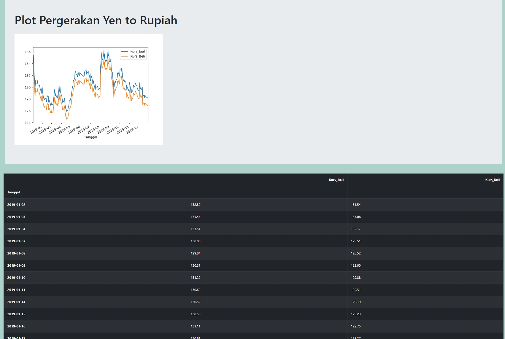

# Web-Scrapping using Beautifulsoup

Projek ini dibuat untuk melakukan webscraping menggunakan BeautifulSoup untuk data di site monexnews terkait dengan pergerakan Kurs Jual beli mata uang Yen. Setelah melakukan web scrapping, kemudian melakukan  data exploratory dan wrangling untuk memastikan data bisa di analisa lebih jauh dan juga bisa ditampilkan secara visual menggunakan Plot atau chart. 

## Modul yang digunakan adalah sebagai berikut

 - beautifulSoup4
-  pandas
-  flask
-  matplotlib

###  Hasil dan Analisa

From the chart, There are some pieces of information we could gather regarding to the data of Ask and Bid for Yen currency in 2019. The first, The Kurs_Jual is always higher than Kurs_Beli in 2019. In August 2019, the Kurs Jual and the kurs_beli reach the highest rate among all months in 2019 to around 134 - 136. and they reach the lowest rate in month of April. From Dec to the end of year 2019, the rate of kurs jual and kurs beli steadily decresed. The rate varies from 124 to 136 for all months in 2019.
